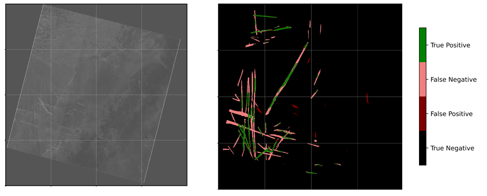

# Detect aircraft contrails with a Unet
## Goal
Label contrails pixel-by-pixel (semantic segmentation) from satellite images for the purpose of validating forecasting models (Models that forecast where contrails can form). The resulting labeled images had two classes (binary), 1. contrail, 2. not a contrail (or everything else).

## Summary of project
This project was mainly meant for me to experiment with applying a CNN to a large dataset. As the title states, I aimed to automate the detection of contrails from satellite images with a Unet. Before this project, I had taken Andrew Ngs online machine learning specialization course and implemented a Unet, but it was all spoon-fed to me, the student, so relatively quick and easy. Upon implementing a Unet on my contrail dataset, I quickly ran into problems that were not covered in the class. Here I list some of the challenges that I had to overcome for this project:

1. Creating/Finding Labeled data for training

I began by creating a tool to manually label a training/test set ([repository here](https://github.com/kjs356/contrail_labeling_tool)). Manually labeling the data was extremely tedious, even with the point-and-click tool. I found many cases where I was unsure if a cloud was a contrail or not. Eventually, I abbandonded using my own labeled dataset because a dataset labeled by a collaborative group at Google and MIT became publically available (McCloskey et al. 2021). The group had multiple people label each image and used "advected aircraft trajectories" to show where contrails could be (if they formed) based on aircraft flight paths. This improved the labeler's confidence in identifying whether a cloud was a contrail or a linear-like cloud.

2. First implementation of Unet

My contrail dataset was several hundred GBs in size which obviously could not all fit into memory. In addition, unlike standard RGB images, I had 6 channels, each representing a different wavelength instead of a different color. In testing, I only sometimes used all 6 channels. Some made more sense to use for detecting contrails than others. I preprocessed my dataset (created my image mask from arrays of contrail polygon points determined by labelers, sliced single images into several smaller reasonably sized images, standardized each channel), converted the dataset to a .tfrecords format and saved (yes, I had another version of the same data... but I won't have to preprocess each time I train... or so I thought... more on that in the dataset imbalance section). I then had to set up the model to randomly load a batch of data that will fit into memory for training, then reallocate that memory to load another batch (TF memory leaks problems were a pain here...). 

3. Image size and blank space in my images

Due to the nature of satellite images, each pixel does not represent the same amount of area (pixels further from the zenith cover more area). Thankfully the dataset already had a Lambert Azimuthal Equal-Area transformation applied. With this transformation, however, the images were no longer rectangular (see example image below in the result section). The pixel values were still saved in a matrix, but there was a lot of 'blank' area around the image. First, I wanted to remove as much of the blank space as possible, so I applied a minimum-bounding rectangle to each image. This made each image a different size, but that was fine since I was slicing them into smaller, consistently sized images. I experimented with making this blank area a third class and simply including it in the 'not a contrail' class; in the end, I found the best solution was to make another channel where the image was all 1s, and the 'blank' area was all 0s. This way, the model could learn what part of the image to look for contrails from that channel and not need to also learn that from the original image channels.

4. Dataset imbalance

The dataset is highly unbalanced as only 0-~2% of pixels often represent contrails. Initially, my model was 99% accurate!!... and simply predicted there was never a contrail... Anyway, I next changed my evaluation metric to IOU, then experimented with versions of loss functions that reduced the relative loss for well-classified classes (the not a contrail class). I also performed some image augmentation methods to shift the balance (removing some images with no contrails, duplicating+rotating/flipping images with contrails... etc. This added several more hyperparameters to test and resulted in several different preprocessed versions of the data.

## Results
Here is an example satellite image (11, 12-micron difference image) and corresponding prediction result.

The best model test IOU = 0.34, which is low compared to the standards of many computer vision tasks, but this is a challenging problem! For perspective, the baseline image processing method (not machine learning) for contrail detection used for the past two decades (Mannstein et al. 1999) produces an IOU of about 0.19.

## What I could try next
When I started this project, it quickly became clear that detecting contrails with machine learning would be very difficult because human observers struggle to confidently identify contrails. If we, the human, cannot do it well, then the model will surely also have a hard time. In my training and testing of the model, I overlooked that the human labelers had more information than I gave the model. As I mentioned in the "Creating/Finding Labeled data for training" section, the labelers had "advected aircraft trajectories" to show where contrails could be (if they formed) based on aircraft flight paths to improve their confidence when labeling a cloud as a contrail. The model would undoubtedly benefit from having this information in the form of another channel. This will mean we cannot detect contrails in (near) real-time since the advected aircraft trajectories require reanalysis windspeed data, but that is not necessary for our purpose of validating forecasting models. 

In addition, I could experiment with more complex CNN architectures (other than a standard Unet), but it is unclear to me that this will create significant improvement. Another approach requiring a new dataset would be to use a time series of images (from a geostationary satellite) to track contrails as they changed from easily identifiable lines to less defined lines. I will not attempt to label such a dataset again by myself...

## What I could do better
I have preprocessing of the data and training of the model completely separate (2 scripts). I do not think preprocessing in parallel with training is reasonable, as preprocessing takes a few hours (longer than an epoch) and would drastically lengthen the training processes. Therefore, keeping the two processes separate is useful since preprocessing would only need to be performed once (unless I want to change hyperparameters in the preprocessing (i.e., how I balance the data)). I could look into ways to improve the efficiency of the preprocessing, in which case preprocessing in parallel with training could work. I should at least create a batch file to run the preprocessing code (if necessary) and then train the model.

## Sources
Mannstein, Hermann, Richard Meyer, and Peter Wendling, "Operational detection of contrails from NOAA-AVHRR-data", International Journal of Remote Sensing 20.8 (1999): 1641-1660.

McCloskey, Kevin, Scott Geraedts, Brendan Jackman, Vincent R. Meijer, Erica Brand, Dave Fork, John C. Platt, Carl Elkin, and Christopher Van Arsdale. "A human-labeled Landsat-8 contrails dataset", https://www.climatechange.ai/papers/icml2021/2

